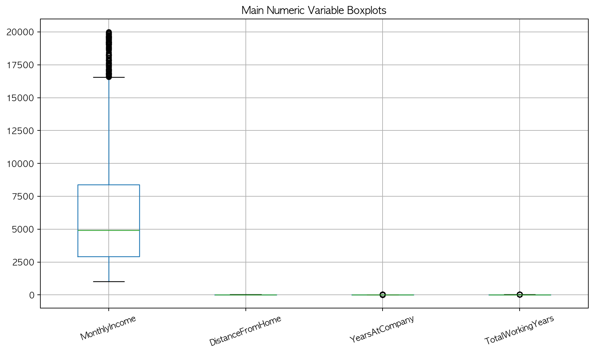
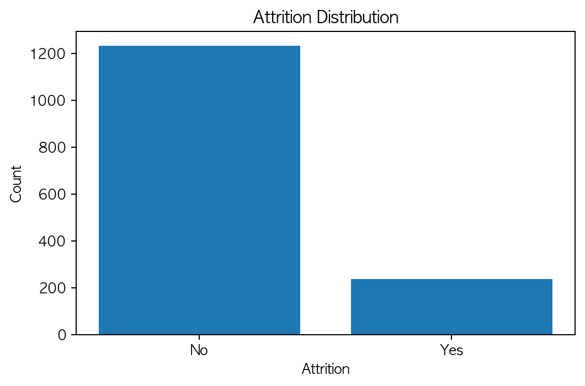
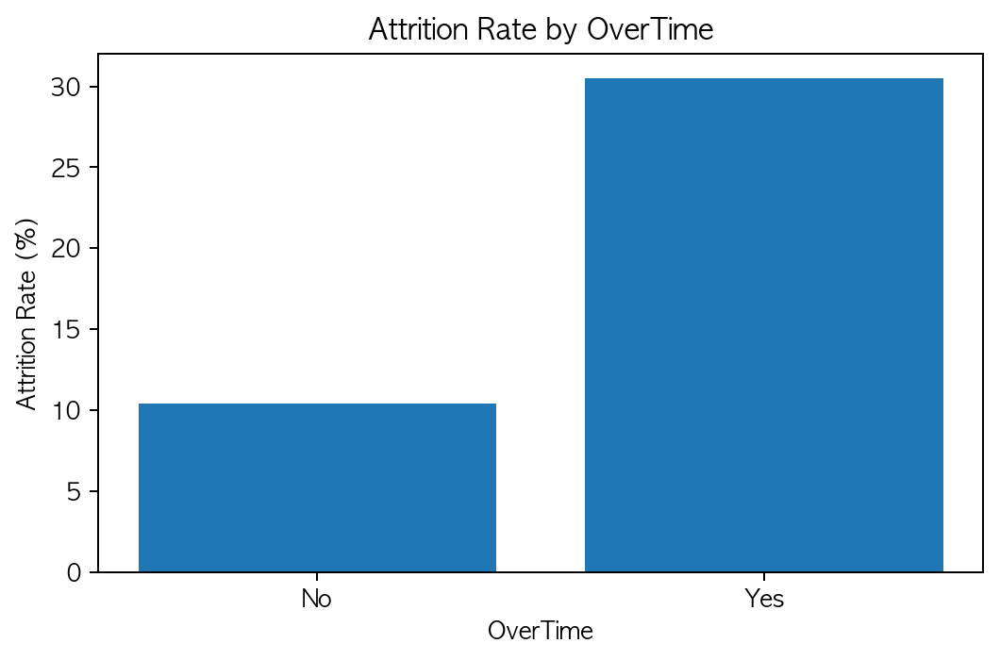
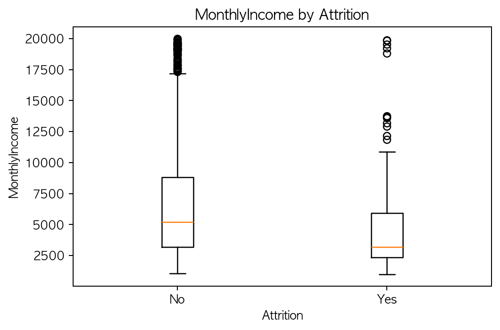
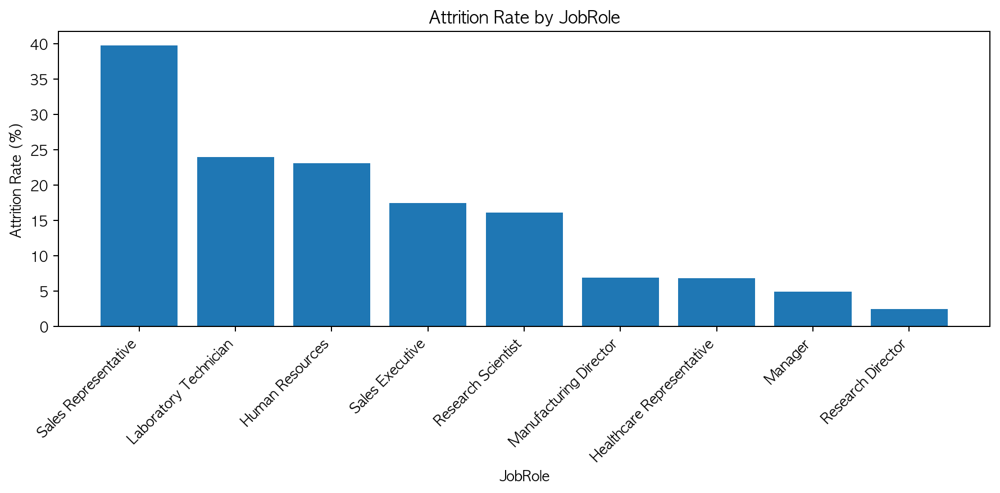
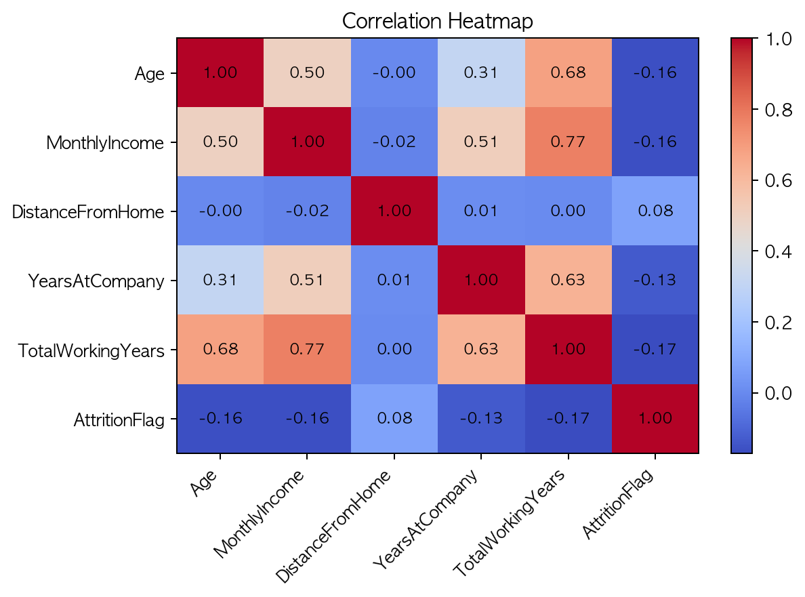

### 📊 EDA 레포트 · 3팀

#### IBM HR 데이터 기반 직원 이직 요인 탐색적 분석

EDA(Exploratory Data Analysis, 탐색적 데이터 분석)는 데이터를 처음 접했을 때 **구조를 이해하고, 패턴을 발견하며, 문제점을 파악**하는 과정을 체계적으로 문서화하는 작업이다.  
본 레포트는 IBM HR 데이터를 바탕으로 직원 이직(`Attrition`)과 관련된 특성을 탐색적으로 분석한 결과를 정리한 것이다.

#### 1. 🎯 프로젝트 개요

- **목적**: 직원 이직은 기업의 채용·교육 비용 증가, 숙련 인력 이탈에 따른 업무 연속성 저하, 조직 운영 안정성 저하를 초래할 수 있는 인사관리상의 주요 pain point이다. 본 분석은 직원 이직 여부(`Attrition`)와 관련된 주요 변수의 패턴을 탐색적으로 파악하고, 향후 이직 예측 및 인사관리 개선에 활용 가능한 기초 인사이트를 도출하는 것을 목적으로 한다.
- **데이터 출처**: Kaggle - IBM HR Analytics Employee Attrition & Performance
- **데이터 구성**: 총 35개 컬럼, 1470개 행
- **분석 대상**: 직원의 인구통계적 특성, 근무 조건, 소득, 근속기간, 직무 관련 정보와 이직 여부(`Attrition`)

> 포인트: 이 분석은 “왜 직원이 회사를 떠나는가?”를 데이터로 이해하려는 시도이다.

#### 2. 🗂 데이터 기본 정보

- **총 데이터 수**: 1470개
- **컬럼 수**: 35개
- **타깃 변수**: `Attrition`
- **주요 수치형 변수**: `Age`, `MonthlyIncome`, `DailyRate`, `DistanceFromHome`, `YearsAtCompany`, `TotalWorkingYears`
- **주요 범주형 변수**: `BusinessTravel`, `Department`, `EducationField`, `Gender`, `JobRole`, `MaritalStatus`, `OverTime`
- **결측치**: 없음
- **참고 사항**: `EmployeeCount`, `Over18`, `StandardHours`는 상수값만 가지는 컬럼으로 확인됨

본 데이터는 수치형 변수와 범주형 변수가 함께 포함된 구조로, **이직 여부를 기준으로 한 그룹 비교 분석**에 적합하다.

#### 3. 📌 기술 통계 요약

##### 3.1 수치형 변수

| 컬럼명 | 평균 | 중앙값 | 표준편차 | 최솟값 | 최댓값 |
|--------|------|--------|----------|--------|--------|
| Age | 36.92 | 36.00 | 9.14 | 18 | 60 |
| MonthlyIncome | 6502.93 | 4919.00 | 4707.96 | 1009 | 19999 |
| DistanceFromHome | 9.19 | 7.00 | 8.11 | 1 | 29 |
| YearsAtCompany | 7.01 | 5.00 | 6.13 | 0 | 40 |
| TotalWorkingYears | 11.28 | 10.00 | 7.78 | 0 | 40 |

##### 3.2 범주형 변수

| 컬럼명 | 고유값 | 최빈값 | 분포 |
|--------|--------|--------|------|
| Attrition | 2개 | No | No: 83.9%, Yes: 16.1% |
| Gender | 2개 | Male | Male: 60.0%, Female: 40.0% |
| OverTime | 2개 | No | No: 71.7%, Yes: 28.3% |
| Department | 3개 | Research & Development | Research & Development: 65.4%, Sales: 30.3%, Human Resources: 4.3% |
| JobRole | 9개 | Sales Executive | Sales Executive: 22.2%, Research Scientist: 19.9%, Laboratory Technician: 17.6%, Manufacturing Director: 9.9%, Healthcare Representative: 8.9%, Manager: 6.9%, Sales Representative: 5.6%, Research Director: 5.4%, Human Resources: 3.5% |

##### 3.3 해석

- `Age`는 평균 36.92세, 중앙값 36세로 나타나 전반적으로 **30대 중반 중심의 분포**를 보인다.
- `MonthlyIncome`은 평균과 중앙값 차이가 커 일부 고소득자의 영향이 존재할 가능성이 있다.
- `YearsAtCompany`와 `TotalWorkingYears`는 최소값과 최대값 차이가 커 **근속기간 및 전체 경력의 편차**가 큰 편이다.
- `Attrition`은 **직원의 이직 여부**를 의미하며, `Yes`는 이직, `No`는 비이직을 뜻한다.
- 전체 직원 중 비이직자 비율이 더 높아 **이직 여부에 다소 클래스 불균형**이 존재한다.
- `Department`는 Research & Development 비중이 가장 높다.

> 포인트: 이 데이터는 “누가 더 많이 떠나는가”를 비교하기에 적합한 구조를 가지고 있다.

#### 4. 🔍 결측치 및 이상치 탐색

- 전체 컬럼 확인 결과 **결측치는 발견되지 않았다.**
- `MonthlyIncome`, `DistanceFromHome`, `YearsAtCompany`, `TotalWorkingYears` 등에 대해 boxplot을 활용하여 이상치 여부를 확인하였다.
- 소득 및 근속기간 변수의 큰 값은 실제 장기근속자 또는 고소득자일 가능성이 있으므로, 단순 제거보다 **분포 특성을 고려한 해석**이 필요하다.
- `EmployeeCount`, `Over18`, `StandardHours`는 정보량이 없는 상수 컬럼으로 분석 제외 후보로 판단된다.

##### 4.1 이상치 확인용 박스플롯

> 포인트: 값이 크다고 무조건 이상치로 제거하기보다, 실제 고소득·장기근속자의 가능성을 함께 고려해야 한다.

#### 5. 📈 변수 간 관계 분석

##### 5.1 이직 여부 분포

`Attrition Distribution`은 **전체 직원 중 이직자와 비이직자의 비율 분포**를 나타낸다.  
그래프를 통해 전체 데이터에서 비이직자(`No`)가 더 많은 비중을 차지하고 있음을 확인할 수 있다.

##### 5.2 초과근무 여부에 따른 이직률

- 초과근무를 하지 않는 집단의 이직률은 **10.4%**였다.
- 초과근무를 하는 집단의 이직률은 **30.5%**로, 초과근무 집단에서 이직 비율이 훨씬 높게 나타났다.

이 그래프는 **초과근무 여부에 따라 이직률이 어떻게 달라지는지**를 보여준다.

> **해석**: `OverTime`은 이직 설명 변수로서 매우 중요한 후보라고 볼 수 있다.

##### 5.3 이직 여부에 따른 월소득 비교

`Attrition별 MonthlyIncome 박스플롯`은 **이직한 직원과 이직하지 않은 직원의 월소득 분포를 비교한 그래프**이다.

- 비이직자 평균 월소득은 **6832.74**
- 이직자 평균 월소득은 **4787.09**

이직자 집단의 평균 월소득이 더 낮아, 소득 수준과 이직 여부 간 차이가 존재할 가능성을 확인하였다.

> **해석**: 월소득 수준이 낮은 집단에서 이직이 더 많이 나타날 가능성을 시사한다.

##### 5.4 이직 여부에 따른 평균값 비교

`Attrition별 평균 비교`는 **이직자 집단과 비이직자 집단의 평균값을 비교한 결과**이다.

- 비이직자의 평균 근속기간은 **7.37년**
- 이직자의 평균 근속기간은 **5.13년**

이직자 집단의 근속기간이 더 짧아, **근속기간과 이직 간 관련성**을 시사한다.

> **해석**: 회사에 오래 근무할수록 이직 가능성이 낮아질 수 있다.

##### 5.5 직무별 이직률 비교

- `Sales Representative`의 이직률이 **39.8%**로 가장 높았다.
- 그 다음으로 `Laboratory Technician` **23.9%**, `Human Resources` **23.1%** 순으로 나타났다.
- 반면 `Research Director` **2.5%**, `Manager` **4.9%**는 상대적으로 낮은 이직률을 보였다.

이 그래프는 **직무(JobRole)에 따라 이직률 차이가 존재하는지**를 보여준다.

> **해석**: 특정 직무군에서 이직이 집중될 가능성이 있으며, 직무 특성에 따른 관리 전략이 필요하다.

##### 5.6 워라밸 및 직무만족도와 이직률

- `WorkLifeBalance`가 1점인 집단의 이직률은 **31.2%**로 가장 높게 나타났다.
- `JobSatisfaction`이 1점인 집단의 이직률은 **22.8%**
- `JobSatisfaction`이 4점인 집단은 **11.3%**

즉, 워라밸과 직무만족도가 낮을수록 이직률이 높아지는 경향이 확인되었다.

> **해석**: 단순 급여뿐 아니라 **직무 만족과 삶의 질**도 이직에 중요한 영향을 미칠 수 있다.

##### 5.7 수치형 변수 상관관계

- `Attrition`과 음의 상관이 상대적으로 크게 나타난 변수는 `TotalWorkingYears`, `JobLevel`, `YearsInCurrentRole`, `MonthlyIncome`, `Age` 등이었다.
- 이는 경력, 직급, 소득 수준이 높을수록 이직 가능성이 상대적으로 낮아질 수 있음을 시사한다.

아래 히트맵은 **주요 수치형 변수 간 상관관계와 이직 여부(`AttritionFlag`)와의 관계**를 시각적으로 보여준다.

> **해석**: 이직은 단일 변수보다는 **경력, 소득, 직급, 근속기간 등 여러 요인이 함께 작용하는 현상**으로 볼 수 있다.

#### 6. 🛠 파생 변수 생성 및 전처리 제안

- `Age` → 연령대 구간화(20대, 30대, 40대 이상)
- `YearsAtCompany` → 근속기간 구간화(`Short`, `Medium`, `Long`)
- `MonthlyIncome` → 분포 왜도가 큰 경우 로그 변환 검토
- 범주형 변수(`BusinessTravel`, `Department`, `JobRole`, `MaritalStatus`, `OverTime`) → 향후 모델링을 위해 인코딩 필요
- 상수 컬럼(`EmployeeCount`, `Over18`, `StandardHours`) → 제거 후보

> 향후 예측 모델을 구축할 경우, 위와 같은 전처리를 통해 변수 활용도를 높일 수 있다.

#### 7. ✅ 요약 및 인사이트

- 초과근무 집단의 이직률이 더 높게 나타나 `OverTime`은 핵심 설명 변수로 활용 가능하다.
- 이직자 집단은 비이직자 집단에 비해 평균 월소득과 근속기간이 더 낮았다.
- `Sales Representative`, `Laboratory Technician`, `Human Resources` 직무에서 상대적으로 높은 이직률이 관찰되었다.
- 워라밸과 직무만족도가 낮을수록 이직률이 높아지는 경향이 나타났다.
- 향후 이직 예측 모델링을 위해 범주형 변수 인코딩, 상수 컬럼 제거, 수치형 변수 분포 점검이 필요하다.

#### 8. 💡 최종 결론

본 EDA를 통해 직원 이직은 단순히 개인 특성 하나로 설명되는 것이 아니라, **초과근무, 소득 수준, 근속기간, 직무 특성, 워라밸, 직무만족도** 등 다양한 요인이 복합적으로 작용한 결과임을 확인하였다.  
따라서 향후 기업의 인사관리 전략에서는 단순 보상체계뿐 아니라 **근무환경 개선, 직무별 맞춤 관리, 장기근속 유도 방안**까지 함께 고려할 필요가 있다.